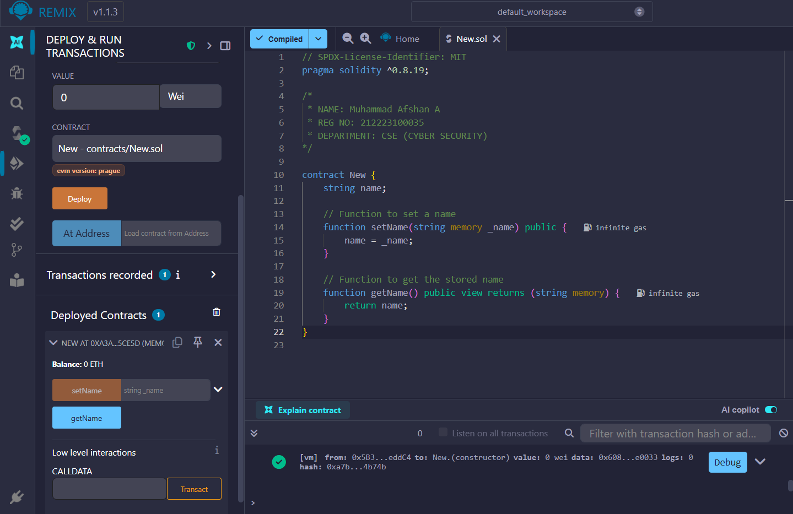
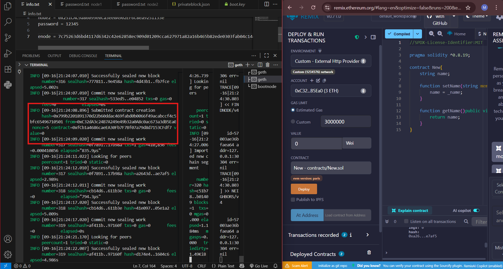

# EX.NO-1  CREATING A PRIVATE DATE: BLOCKCHAIN

## AIM
To create a Private Blockchain and to add nodes, create accounts, transfer Ether into it by creating
and deploying Smart contract.

## PROCEDURE


1. Go to https //geth.ethereum.org/ and download the software for windows. While installing select
both geth and development tools.

2. To check whether the geth is installed ,run `geth` command in your command prompt.

3. To create a Private Blockchain , we must create a      genesis block.
In your command prompt, create a directory go-ethereum.
    - `mkdir go-ethereum`
    - `cd go-ethereum`

4.  two nodes inside go-ethereum.
    - `mkdir node1`
    - `mkdir node2`

5. Open vs code using `code .` command, 
To create account for two nodes

6. Open terminal in vs code and change directory to node1.
    - `cd node1`
    - `geth --datadir "./data" account new`

    Save the public address and password of node1 in info.txt.

7. Repeat the same procedures for node2
    - `cd ..`
    - `cd node2`
    - `geth --datadir "./data" account new`

    Save the public address and password of node2 in info.txt,To create a genesis block

8. Create a file named `privateblock.json` inside go-ethereum.
    - Replace {Chain id } with your own chain id and check whether it exists or not using `https://chainlist.org/`

    - Replace initial signer address and firstnode address with node1 address saved in info.txt.

    - And second node with node2 address saved in info.txt.

    - Then replace balance as “3000000000000000000” for both nodes , to configure both nodes using genesis block.

9. Change directory to node1 in terminal and run this command.
    - `geth --datadir ./data init ../privateblock.json`

10. Split terminal and cd to node2 and run the same.

11. Again split terminal and create bootnode.
    - 'mkdir bnode'
    - 'cd bnode'

12. To generate key:
    - bootnode -genkey boot.key
    - bootnode -nodekey boot.key verbosity 7 -addr "127.0.0.1 30301"

13. save the enode value in info.txt.

14. Run node1 and node2 , To start node1:

    - `geth --datadir "./data" --port 30304 --bootnodes enode //{ YOUR_VALUE } --
authrpc.port 8547 --ipcdisable --allow-insecure-unlock --http --http.corsdomain="https://remix.ethereum.org" --http.api web3,eth,debug,personal,net --networkid { NETWORK_ID } --
unlock { ADDRESS_NODE1 } --password { PASSWORD_FILE_NAME_EXTENSION } --
mine --miner.etherbase= { SIGNER_ADDRESS }
To start node2 > geth --datadir "./data" --port 30306 --bootnodes enode //{ YOUR_VALUE } -
authrpc.port 8546 --networkid { NETWORK_ID } --unlock { ADDRESS_NODE2 } --password
{ PASSWORD_FILE_WITH_EXTENSION }`

    - Replace Node1 address in {signer address} and {address node1} and enode value with
{your value}

    - {Network id} is your chain id given in privateblock.json.

    - Create password.txt undernode1 and node2 and enter the password in it.

    - Replace password.txt with    {PASSWORD_FILE_NAME_EXTENSION }.

15. Go to `https://remix.ethereum.org/` and in left pane click deploy and run transactions icon.

16. Change the environment to Custom-External HTTP Provider

17. Click on file and under contract, create new file named `New.sol`

18. Save the file and go to deploy tab and click deploy.

19. Node1 has deployed and added to blockchain.

## PROGRAM
### Genesis file privateblock.json

```json
{
  "config": {
    "chainId": 123457,
    "homesteadBlock": 0,
    "eip150Block": 0,
    "eip155Block": 0,
    "eip158Block": 0,
    "byzantiumBlock": 0,
    "constantinopleBlock": 0,
    "petersburgBlock": 0,
    "istanbulBlock": 0,
    "berlinBlock": 0,
    "clique": {
      "period": 5,
      "epoch": 30000
    }
  },
  "difficulty": "1",
  "gasLimit": "8000000",
  "extradata": "0x00000000000000000000000000000000000000000000000000000000000000000c6d2bDc16515859984b57F72C853699270D7e530000000000000000000000000000000000000000000000000000000000000000000000000000000000000000000000000000000000000000000000000000000000",
  "alloc": {
    "0c6d2bDc16515859984b57F72C853699270D7e53": { "balance": "3000000000000000000" },
    "85c0786f28dC8322364291cfF50C4f34Af5fE60f": { "balance": "3000000000000000000" }
  }
}
```

### Smart Contract New.sol

```solidity
// SPDX-License-Identifier: MIT
pragma solidity ^0.8.19;

/*
 * NAME: Muhammad Afshan A
 * REG NO: 212223100035
 * DEPARTMENT: CSE (CYBER SECURITY)
*/

contract New {
    string name;

    // Function to set a name
    function setName(string memory _name) public {
        name = _name;
    }

    // Function to get the stored name
    function getName() public view returns (string memory) {
        return name;
    }
}

```

# OUTPUT
# Deploying Transaction in Remix



# Contract Creation Output in Command Prompt



# RESULT:
Thus, the Private Blockchain is created, nodes are added with accounts, and Ether is transferred
into it by creating and deploying Smart contract successfully
